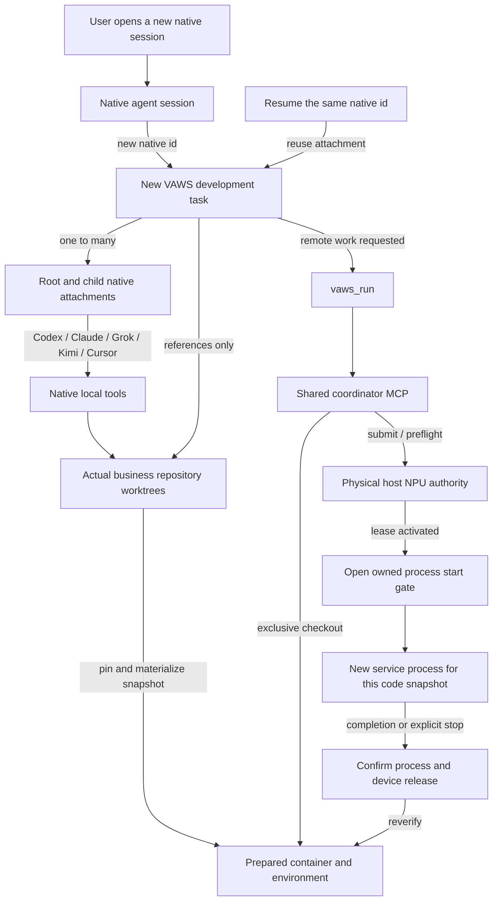

# Ready runtimes and cooperative execution

This is an opt-in, shared Streamable HTTP MCP service, independent of
`vaws-top`. It reuses **idle prepared containers**, environments and native
artifacts. It does not keep model services resident: each development run
starts its service using a pinned code snapshot.

## Authority and scope

| State | Owner |
| --- | --- |
| Machine directory | `shared_inventory_path()` in the primary Git worktree, from PR #67 |
| VAWS task identity and native session attachments | Local `agent-sessions` registry, independent of the fleet |
| Remote task references, exclusive runtime bindings, reserved service ports, managed jobs, messages | One shared coordinator database |
| NPU tasks, queue, fences, activation and release | Existing `vaws_npu_coordination.py` on each physical host |
| Source edits and execution outputs | The actual business worktree and its local state |

All participating clients, including independent clones, must connect to the
**same manager**. Linked worktrees share its default state directory via Git
common-dir; unrelated clones do not discover each other automatically. One
process holds `manager.lock`; do not deploy separate databases for the same
runtime pool. Use canonical host addresses and only register containers
dedicated to this pool, after resolving any old managed-session claims.

Legacy session-local `leases.json` remains a compatibility mechanism, not a
cross-workspace allocator. The new path does not create a second local NPU
lease: every request goes to the existing host authority. Direct SSH,
unmanaged containers and generic remote-dev writes remain outside cooperative
enforcement. An MCP fence is not an OS access-control boundary.

## Task and native session lifecycle



A new native root always creates a new VAWS task, including when another task
uses the same cwd. **Resume of the same native session keeps the same VAWS
task.** Child attachments inherit their recorded parent; an unrelated new
native session joins only through explicit user assignment. No transcripts,
window ids, branch names or "most recent session" guesses are used.

Worktrees isolate repository code. A task may reference several actual
repositories; create worktrees using native Git tools when needed and bind
those paths. The task layer never resets, copies or deletes them. It needs no
VAWS scaffold worktree per task and no machine to exist. A remote checkout is
an execution resource, not the identity of the task or its native sessions.

SessionEnd only records a detached attachment. A missed end hook does not
establish that a window is alive or authorize resource cleanup. Managed jobs
outlive frontend disconnection and have explicit timeouts. `vaws_finish` stops
owned executions and returns runtimes only after release; it preserves local
sources. Resume after finish reopens the same task, retaining its execution
history. This is a job lifecycle, not a separate workflow engine.

### Configure native attachments once

Use Python 3.11+ for the local setup helper. Preview the files, then apply:

```bash
python3 /path/to/vaws/.agents/scripts/vaws_client_setup.py --client codex --project /actual/business/worktree
python3 /path/to/vaws/.agents/scripts/vaws_client_setup.py --client codex --project /actual/business/worktree --apply
```

`--client` accepts `claude`, `grok`, `kimi`, `codex`, `cursor`. The helper merges
hooks/MCP entries, preserves other hooks and permission settings, and places
private backups under `.remote-dev/state/client-setup/`. It never authenticates
a client or grants trust. Complete the client's normal trust/approval prompts
and resume/start it to load the hooks. Configuration is not acceptance.

Codex reviews new or changed hooks in `/hooks`; Cursor Agent separately approves
the workspace and MCP server. Kimi skips project MCP configuration in an
[untrusted workspace](https://github.com/MoonshotAI/kimi-code/blob/main/packages/agent-core-v2/AGENTS.md);
use its normal workspace trust flow and `/mcp` to check
the loaded servers. Do not work around those approvals with a shell import of
the server implementation and report it as a native MCP call.

| Client | Hook configuration | Native context delivery |
| --- | --- | --- |
| Claude Code | `.claude/settings.local.json` | SessionStart context and PreToolUse input augmentation |
| Codex | `.codex/hooks.json` | SessionStart context and PreToolUse input augmentation; hook review remains required |
| Grok | `.grok/hooks/vaws-session.json` | PreToolUse input augmentation; project trust remains required |
| Kimi Code | Project-scoped entries in the actual user `config.toml` | UserPromptSubmit text; MCP stays in `.kimi-code/mcp.json` |
| Cursor | `.cursor/hooks.json` | sessionStart additional context; MCP stays in `.cursor/mcp.json` |

Kimi's user-level hook is guarded by the actual project path; use
`--kimi-config` if the client loads a custom config. Grok's imports of Claude
and Cursor hook files are ignored by those compatibility adapters to avoid
duplicate task creation. If a client omits a child identifier, the adapter
reports the missing association and does not invent one. The explicit adapter
entry `.agents/scripts/vaws.py attach --parent-context ...` accepts the
actual native id. For cross-tool spawning, pass `VAWS_PARENT_CONTEXT` to that
child process only; explicit user assignment uses `VAWS_ATTACH_CONTEXT`.
Never export these association variables globally for new user tasks.

These adapters follow the native contracts in the
[Claude hooks documentation](https://code.claude.com/docs/en/hooks),
[Codex hooks documentation](https://learn.chatgpt.com/docs/hooks),
[Grok hook implementation guide](https://github.com/xai-org/grok-build/blob/main/crates/codegen/xai-grok-pager/docs/user-guide/10-hooks.md),
[Kimi hooks documentation](https://moonshotai.github.io/kimi-code/en/customization/hooks),
and [Cursor hooks documentation](https://cursor.com/docs/hooks).
New native lifecycle behavior still needs actual client calls in addition to
the regression fixtures. Configuration, schema discovery, a connected server,
or a direct adapter call establishes control-plane compatibility only; it does
not establish the native client lifecycle.

### Task-facing execution

The existing remote-dev stdio server adds four portable names: `vaws_session`,
`vaws_run`, `vaws_execution`, `vaws_finish`. Native context identifies the task;
the agent supplies intent, source paths and the desired resource/environment.
Users do not need to manage attachment, binding, fence or process receipt ids.

`vaws_session(sources={"vllm": "/actual/vllm", "vllm-ascend": "/actual/va"})`
binds actual worktrees without contacting the fleet. To enable remote work,
place an untracked `coordinator-client.json` alongside `agent-sessions/`:

```json
{"url":"http://127.0.0.1:8766/mcp","token_file":"/private/path/to/token"}
```

The token file must be mode `0600`. Alternatively launch the client with
`VAWS_COORDINATOR_URL` and `VAWS_COORDINATOR_TOKEN`. Use HTTPS or a loopback
tunnel. Local task creation/editing/finish without remote jobs works offline.

`vaws_run` takes a stable request id, command, optional exact `profile_key` or
`runtime_id`, and either physical `devices` or `npu_count`. Without a selected
profile, it proceeds only when there is one unique ready profile. No suitable
runtime returns a waiting/cache-miss result without Docker, pip or compilation.
The agent may continue local work. Explicit environment preparation is a
separate operator action.

On a warm hit the facade materializes one parity snapshot, persists its id,
and submits a managed job. The manager prepares a waiting supervisor, verifies
its host PID, activates a host lease, then opens its start gate. It renews that
persisted execution independently of frontend connections. A live marked
process retains the host allocation even during CPU initialization with no
visible NPU process. Unknown ownership retains resources. Stopping a job
signals only its recorded process family, then separately checks device release
and re-verifies the container before reuse. Generic direct endpoint operations
remain cooperative and do not acquire these protections automatically.

Use `vaws_execution` for status/tail/stop. A lost launch reply is reconciled by
the same job/request id; it must not cause another source materialization or
another model launch. Start a new execution id after editing. Native outputs
can be reused only when their source/build/environment identity still matches;
every development execution starts a new service process.

## Start the shared manager

Requires Python 3.10+ on the manager (CI uses 3.12), not torch/torch_npu.
Install `.agents/coordinator/requirements.txt` in a dedicated virtualenv.
The official MCP Python SDK is pinned to 2.1.1; the existing remote-dev MCP
server and tool names are unchanged.

Create a private, **untracked** access file under `.vaws-local/coordinator/`:

```json
{
  "principals": {
    "developer-a": {"sha256": "<64-hex SHA256 of a random bearer token>", "admin": false},
    "pool-operator": {"sha256": "<64-hex SHA256 of a different random bearer token>", "admin": true}
  }
}
```

Generate at least 32 random bytes for each token. Store the tokens only in
client secret configuration, never in tracked files. Set access-file mode
`0600`. Start one process:

```bash
python .agents/coordinator/server.py \
  --access-file /absolute/primary-worktree/.vaws-local/coordinator/access.json
```

It binds `127.0.0.1:8766/mcp`. Configure each MCP client with that HTTP endpoint
and `Authorization: Bearer <its token>`. Other machines can use authenticated
SSH forwarding to the same loopback service. This is a private cooperative
fleet service, not a public OAuth authorization server. Host/Origin checks
remain enabled. No monitor, Docker daemon on the manager, or model service is
required. Service-manager installation is an operator deployment step, not
performed by importing or running tests in this PR.

### Coding clients

Use the same HTTP manager from every client, with a separate non-admin token
per principal. Keep the configuration below in private local files; the
placeholder is not a token and must not be committed after replacement.
The existing remote-dev MCP remains a separate server.

Claude Code project `.mcp.json`, Kimi Code `.kimi-code/mcp.json`, and Cursor
project `.cursor/mcp.json` accept this shape:

```json
{
  "mcpServers": {
    "vaws-coordinator": {
      "type": "http",
      "url": "http://127.0.0.1:8766/mcp",
      "headers": {"Authorization": "Bearer <PRIVATE_CLIENT_TOKEN>"}
    }
  }
}
```

For Claude Code, approve the project server or pass this private file through
`--strict-mcp-config --mcp-config /absolute/path/config.json`. Kimi requires
trusting the project folder before enabling its project MCP; start a new
session after changing the server configuration. See the
[Kimi MCP documentation](https://www.kimi.com/code/docs/kimi-code-cli/customization/mcp.html).
In Cursor IDE, enable this source under **Tools & MCPs**, confirm that its
the coordinator tools are connected, and start a new agent. Cursor CLI authentication is
separate from a working IDE session.

Codex `.codex/config.toml` can use a token environment variable:

```toml
[mcp_servers.vaws_coordinator]
url = "http://127.0.0.1:8766/mcp"
bearer_token_env_var = "VAWS_COORDINATOR_TOKEN"
```

Export that principal's token in the environment launching Codex. Grok's
project `.grok/config.toml` uses `headers`:

```toml
[mcp_servers.vaws-coordinator]
url = "http://127.0.0.1:8766/mcp"
enabled = true

[mcp_servers.vaws-coordinator.headers]
Authorization = "Bearer <PRIVATE_CLIENT_TOKEN>"
```

The coordinator tool names use underscores (`session_open`,
`execution_request`, etc.). Client discovery prefixes may differ; do not
rename existing remote-dev tools or use a dotted-name compatibility wrapper.

To verify a new client, perform actual tool calls: open the same logical
session twice and compare ids; inspect its owner-scoped status; request an
unprepared profile and require `cache_miss` with `provisioning_started=false`;
confirm that non-admin `runtime_register` fails; then inspect the runtime
catalog and event cursor. A connection indicator or `tools/list` alone does
not verify these contracts. Use a fresh private manager for an empty-catalog
test; never reset a live manager to make an acceptance assertion pass.

## Prepare once, outside the launch path

1. Use existing machine-management/session preparation and approved parity
   install commands to prepare an owned container. Do not adopt somebody
   else's active container or silently change host CANN/drivers.
2. Stop and verify **only its owned workers**. Keep the container running.
   Materialize clean parity snapshots of vLLM and vllm-ascend. Verify the exact
   environment combination on the target SoC; an image tag alone is not proof.
3. Provide an untracked preparation specification with `profile` and `files`.
   `profile` requires exact strings for `image_digest`, `soc`, `driver`, `cann`,
   `python_abi` (SOABI), `torch`, `torch_npu`, `vllm`, `vllm_ascend`, `compiler`;
   `build_env`, `launch_env`; an operator-reviewed `compatibility_evidence`
   reference; and `system_files` entries for actual CANN/driver version files
   (`{"path": "/absolute/path", "sha256": "..."}`). Include additional critical
   `.pth`, compatibility-library or compiler files when the profile needs them.
   Optional `packages` pins additional installed dependencies (for example
   NumPy or Triton). Record build flags from the actual successful build recipe;
   a handwritten manifest cannot infer what an arbitrary old library was built
   against. Record deployment-required values such as `VLLM_VERSION` and the
   full `VLLM_PLUGINS` selection explicitly; no version pair is inferred.
4. `files` explicitly enumerates every runtime output relative to the runtime
   root, mapping each path to a role. At minimum it needs `library` and
   `metadata` roles. For Ascend custom operators include the kernel library,
   `binary_info_config.json`, vendor metadata and associated binaries; the
   preparer owns that complete dependency list. Do not include CMakeCache.txt
   or symlinks into another worktree.
5. Inside the container, using remote-dev, run:

```bash
python .agents/coordinator/prepare_runtime.py attest \
  --root /vllm-workspace --spec /path/to/private-preparation-spec.json \
  --owned-workers-stopped
python .agents/coordinator/prepare_runtime.py publish \
  --root /vllm-workspace --cache /root/.cache/vaws/native-bundles \
  --owned-workers-stopped
```

Attestation checks installed versions/ABI/system-file hashes, executes import
smoke (`torch_npu`, `vllm`, `vllm_ascend`, `acl`, and the actual
`vllm_ascend_C` extension), fingerprints native inputs and
writes `.vaws-runtime/ready-profile.json`. It does not prove model correctness,
all possible operator dependencies or multi-node compatibility. Bundles are
atomically published by profile/build identity and verified before reuse.
Declared native submodules must be populated, clean and tracked at their
pinned commits. Their cache identity uses recursive file content, so a new
task's synthetic commit metadata alone does not invalidate unchanged kernels.
Restoration deliberately requires the same installation path; relocatability
of editable installs/native operators is not assumed.

An administrator then calls `runtime_register` with a unique runtime id and:

```json
{
  "machine": "<existing shared-inventory alias>",
  "container_name": "<owned prepared container>",
  "port": 46010,
  "root": "/vllm-workspace",
  "service_ports": [18010]
}
```

Alternatively use explicit `host_endpoint`, `endpoint` and `container_name`.
`machine_catalog` uses the same shared inventory loader as the toolbox;
`runtime_catalog` lists prepared identities. The old inventory's base container
is not automatically adopted. Registration/checkout verifies the Docker
identity, idle workers, free declared TCP ports, packages, input fingerprints
and complete output hashes. Uncertain probes produce a miss/repair state.
`service_ports: []` reserves no serving ports and is suitable for operator jobs.

## Agent development loop

1. `session_open` records the actual local source paths; it creates no business
   checkout and binds no machine. `runtime_checkout` selects an exact profile
   (optionally a specific runtime) with an idempotency key. The returned
   `host/port/user/root/cwd` fields work with existing remote-dev tools.
2. With no execution pending/active, synchronize using parity's low-level
   direct endpoint arguments and **`--apply-mode materialize`**. Add
   `--source vllm=/actual/worktree --source vllm-ascend=/actual/worktree` for
   external sources. This only updates source; it cannot install or compile.
   Export the returned environment fingerprint and the profile's build flags
   when computing parity build inputs. Do not use legacy `auto/install` as
   the pool's warm checkout path: a new client's local install history may
   otherwise request an unnecessary first rebuild.
3. Keep editing with the staging watcher:

```bash
python .agents/skills/remote-code-parity/scripts/parity_watch.py --interval 1 -- \
  --workspace-root /actual/scaffold --workspace-id task-a \
  --source vllm=/actual/vllm --source vllm-ascend=/actual/vllm-ascend \
  --server-name runtime-a --runtime-root /vllm-workspace \
  --container-identity prepared-a@/vllm-workspace \
  --container-host HOST --container-port PORT --container-user root
```

The watcher hashes content (including subsequent edits to the same dirty file)
and incrementally publishes Git objects to the container cache. It **never
materializes the runtime or builds**. A concurrent edit remains pending for
the next cycle. The running source tree stays fixed. Watcher output is JSONL
and is staging evidence, not a ready model endpoint.

4. `execution_request` pins the actual materialized `snapshot_commits`, expected
   `build_key`, exact `devices` or `npu_count` (`devices: []` for count mode),
   priority and queue deadline. Changed native inputs or missing output files
   fail before asking for cards. A compatible warm hit creates no container,
   installs no dependencies and performs no compilation.
5. For a cache miss, explicitly restore a matching bundle with
   `prepare_runtime.py restore --cache ... --build-key ...`, or use the
   existing installer to build only changed inputs, then attest/publish.
   `runtime_refresh` accepts this new preparation only when no execution is
   unresolved and the environment profile is unchanged. Building/preparing
   is an explicit separate operation, never hidden inside a launch.
6. Poll until granted; call `execution_control(action="preflight")` immediately
   before launch. Use the returned physical `ASCEND_RT_VISIBLE_DEVICES`, the
   binding's reserved service ports and `launch_preamble` through remote-dev.
   The preamble **prepends** PATH/PYTHONPATH/LD_LIBRARY_PATH instead of removing
   base acl/native-compat paths. Start a new owned service/job, activate with
   its PID promptly (do not wait for weight loading), and heartbeat while it
   runs. Readiness still needs all ranks and an actual model request.
   Only `poll` may submit a locally pending, unsubmitted request to the manager.
   `preflight`, `activate`, `heartbeat`, and `release` reject that state without
   contacting the host; `cancel` records local cancellation without submitting it.
   A never-submitted pending request cancels or expires locally even while its
   host stays unreachable, because no host mutation was ever sent for it.
7. Stop only this run's workers, then request `release`. The host must observe
   every leased device free in repeated samples. `runtime_return` quarantines
   the container until it is re-verified; it never kills a process or infers
   successful cleanup from a client timeout. For managed jobs the manager
   performs this re-verification itself: finishing supervision re-registers the
   runtime through `runtime_register`, which re-runs the same idle-container
   inspection and full profile/source verification an administrator would run.
   If that verification fails, the runtime stays quarantined in `needs_repair`
   until an administrator inspects it and registers it manually; returning a
   plain (non-managed) binding always needs that administrator re-registration.

The Linux execution supervisor is a child subreaper and remains responsible
for the complete descendant family until every child has exited and the
completion receipt is durable. `setsid` and a clean environment do not escape
that ancestry tracking. If the supervisor disappears without a completion
receipt, the execution is `unknown` and its card lease remains protected until
host ownership is reconciled; garbage collection must not silently release it.

The manager exports Run Manifest v1 records under its untracked `runs/`
directory. It never marks a run `passed` merely because an allocation was
released. Domain validation workflows attach their own acceptance evidence.

## Cooperation and failure handling

Before machine maintenance, an administrator calls `runtime_drain` for every
registered runtime on that host. New checkouts stop; current owners retain
their bindings and jobs until they explicitly finish. Returned draining
runtimes are not automatically re-registered. Maintenance itself remains an
explicit operator action; re-register only after the environment is verified.

`coordination_peers`, `coordination_message`, `coordination_reply` and cursor-based
`coordination_events` support cooperative yield requests. Messages carry sender
identity and are untrusted text, not commands or permission to stop a peer.
Accepting a request does not release devices. Clients must poll/listen; MCP
does not wake a paused agent automatically.

The resident manager advances the host queue and reconciles persisted requests
in bounded batches. Manual `execution_*` leases still require their caller's
heartbeats. Explicitly registered `managed_execution_*` jobs are renewed by
the manager and survive frontend disconnects; idle native attachments are not
heartbeated as executions.
Lost replies are recovered using the same task id. A changed host epoch or a
missing previously submitted task stays `uncertain`; inspect real ownership
before manual reconciliation. Do not delete state to make a resource appear
available. Manager restart preserves bindings/events; the host's `/tmp` epoch
remains explicitly separate from that durable state.

If a managed job's remote directory disappears while its card lease stays
active, the job wedges in `stopping`: the manager never infers completion from
a lost directory, and the host retain guard keeps the cards allocated.
Recovery is an explicit operator action: inspect the host, confirm the job
directory is gone and the process family is dead, then call
`execution_reconcile(run_id, reason, evidence=..., force_release=true)`. The
bounded evidence string is required and is recorded in the durable
`run-reconciled` event; `force_release` releases the host lease with confirmed
completion so the retain guard is cleared and the cards are freed. Without
evidence the reconcile is rejected — the default stays fail-closed. Afterwards
return the runtime for quarantine and re-verification before any reuse.

## Validation boundaries and current limits

CI uses the actual HTTP MCP SDK with two principals and the real SQLite host
protocol, but simulated container/occupancy probes. It covers competing
management roots, authentication, ownership, restart, message cursors, no hidden
provisioning, native inputs and complete-bundle corruption/missing-file cases.

Treat native client lifecycle, real hardware execution, model service readiness,
operator correctness, and performance as separate evidence tiers. Passing the
control-plane suite does not establish any of them. Record environment identity,
all-rank logs, bounded real requests, and requested metrics in the PR validation
report when those claims are required.

On upgrade, re-attest/publish prepared runtimes containing native submodules:
their old commit-based input keys will fail the new content-based verification.
No implicit rebuild or fallback to an old marker is performed.

Multi-host atomic/gang allocation, pool auto-replenishment and transparent
adapters for every legacy domain wrapper are not implemented in this version.
